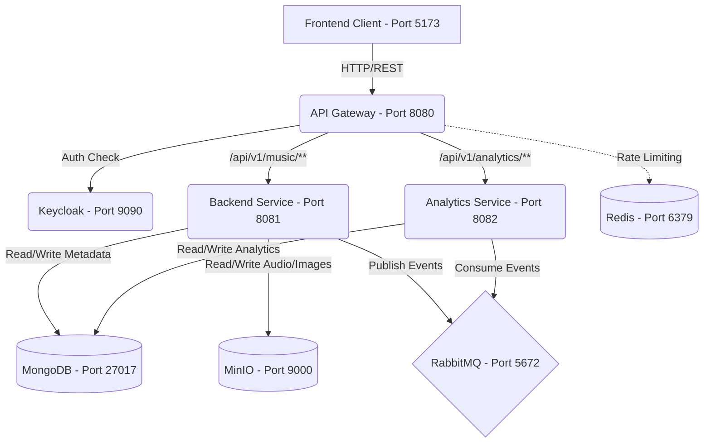

# 🎧 simplyMusic - Event-Driven Audio Microservices

A distributed, enterprise-grade music streaming and cataloging platform built with **Spring Boot**, **React**, and an asynchronous **RabbitMQ** event-driven architecture. 

Unlike standard monolithic CRUD applications, simplyMusic is designed for fault tolerance and scalability. It separates heavy media streaming, real-time analytics, and user authentication into isolated, independent microservices running in Docker.

##  Core Architecture & Data Flow

The system is built on a decoupled microservices architecture to ensure high availability and prevent performance bottlenecks during large file uploads.



1. **Authentication (Keycloak):** All endpoints are secured behind Keycloak Identity Access Management (IAM). Users receive secure JWTs to access the platform.
2. **Main API Gateway (Spring Boot):** Intercepts requests, validates JWTs, and handles the orchestration of uploads. 
3. **Split Storage Strategy:** 
   - Heavy binary `.mp3` files are streamed directly into a self-hosted **MinIO** (S3-compatible) object storage vault.
   - Lightweight track metadata (Title, Artist, Duration) is saved to **MongoDB** for rapid indexing and retrieval.
4. **Asynchronous Event Bus (RabbitMQ):** Once an upload or play event occurs, the Main API fires a message into RabbitMQ and immediately responds to the user.
5. **Analytics Service:** An isolated Spring Boot microservice that listens to the RabbitMQ message broker. It independently tracks play counts and library metrics in its own database without adding computational load to the main streaming server.
6. **Enrichment Service:** An external integration layer that identifies audio via voice search or metadata analysis.

##  Tech Stack

**Frontend**
* React.js (Vite)
* Tailwind CSS
* Lucide React (Icons)
* Axios / Fetch API

**Backend & Infrastructure**
* Java 17+ / Spring Boot 3
* Spring Security (OAuth2 / JWT Resource Server)
* Docker & Docker Compose
* MinIO (Object Storage)
* MongoDB (NoSQL Database)
* RabbitMQ (Message Broker)
* Keycloak (Identity & Access Management)

## 🚀 Getting Started

To run this project locally, you will need **Docker**, **Java (JDK 17+)**, and **Node.js** installed on your machine.

### 1. Boot up the Infrastructure

1. Clone the repository:
   ```bash
   git clone <repository-url>
   cd simplyMusic
   ```
2. Set up your environment variables by copying the example file:
   ```bash
   cp .env.example .env
   ```
3. Open the `.env` file and fill in your own secure passwords.
4. Start the core infrastructure components (Keycloak, MinIO, MongoDB, RabbitMQ, Redis) using Docker Compose:
   ```bash
   docker-compose up -d
   ```

### 2. Start the Backend Microservices
Open separate terminal windows to run each Spring Boot microservice:

**Main Backend API (Port 8081):**
```bash
cd backend
./mvnw spring-boot:run
```

**Analytics Service (Port 8082):**
```bash
cd analytics-service
./mvnw spring-boot:run
```

**Enrichment Service (Port 8083):**
```bash
cd enrichment-service
./mvnw spring-boot:run
```

### 3. Start the Frontend
Navigate to the frontend directory, install dependencies, and start the development server:
```bash
cd frontend
npm install
npm run dev
```

The application will be accessible at `http://localhost:5173`.

##  Features

- **Library Management**: Upload and organize your music library. View track details, album art, and duration.
- **Audio Streaming**: Play your uploaded tracks with a global persistent audio player.
- **Favourites System**: Like your favourite tracks and access them from a dedicated view.
- **Voice Search Integration**: Find songs by audio identification using the enrichment service.
- **Real-Time Analytics**: View global library statistics and personal playback history via a dedicated analytics dashboard.
- **Secure Access**: Enterprise-grade identity management with Keycloak protecting your data.


