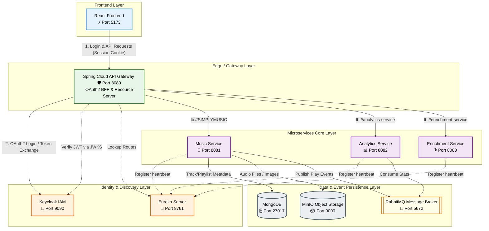
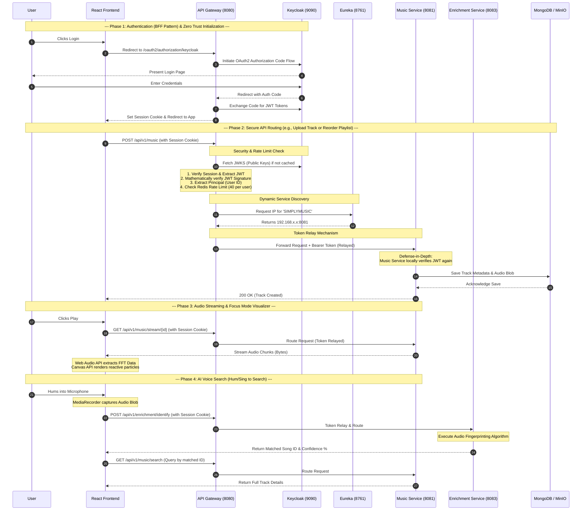

# SimplyMusic Architecture & Sequence Flow

This document details the complete end-to-end architecture and sequence flow of the SimplyMusic application, including all the microservices, frontend systems, and newly implemented features (like the visualizer, voice search, and Gateway-level Zero Trust security with the Backend-For-Frontend pattern).

## Microservices Overview

*   **React Frontend:** The client-facing application featuring the Web Audio API visualizer, Drag-and-Drop library management, and Analytics dashboard. It now securely communicates with the API Gateway using session cookies, removing the need to manage JWTs directly in the browser.
*   **Keycloak:** Handles Identity and Access Management (OAuth2/OIDC) and provides the JWKS (JSON Web Key Set) for token cryptographic verification.
*   **API Gateway:** Spring Cloud Gateway running on port `8080`. Acts as a Backend-For-Frontend (BFF) and the primary security checkpoint (OAuth2 Client & Resource Server). It handles the OAuth2 Login flow, maintains user sessions, validates JWTs, performs user-based rate limiting, handles CORS (with credentials), and executes dynamic routing via Token Relay.
*   **Eureka Server:** Netflix Eureka for Service Discovery running on port `8761`.
*   **Music Service (backend):** Core CRUD service running on port `8081` for managing Tracks, Playlists, Favourites, and audio file streaming. Implements defense-in-depth by re-validating the relayed JWT.
*   **Enrichment Service:** Handles AI Voice Search audio fingerprinting and metadata enrichment.
*   **Analytics Service:** Collects asynchronous telemetry data (play counts, listening time, genre preferences) to power the user dashboard.

## High Level Architecture Diagram

This flowchart represents the structural topology of the system. It has been color-coded and organized by infrastructure layers to clearly illustrate how the React Frontend negotiates authentication via the BFF pattern, how the API Gateway secures the perimeter, and how data flows through the microservices.

## Detailed Application Sequence Diagram

The following sequence diagram outlines the exact order of operations. It highlights the new Backend-For-Frontend (BFF) Zero Trust Security model, showing where token relay and cryptographic validations occur before data is persisted.

## Key Implemented Features Breakdown

### 1. The Focus Mode Visualizer
*   **Mechanism:** Connects an HTML5 `<audio>` element to the Web Audio API's `AnalyserNode`.
*   **Logic:** Extracts Fast Fourier Transform (FFT) arrays 60 times a second to capture real-time audio frequencies.
*   **Rendering:** Uses a 2D HTML Canvas to draw thousands of particles that scale, pulse, and animate directly matching the frequency amplitude of the music. Includes a physics-based "magnetic repulsion" effect calculated via the Pythagorean theorem tracking the user's mouse coordinates, creating an interactive and immersive experience.
*   **Theming:** Automatically detects the UI's Light/Dark mode and extracts the dynamic ambient color from the currently playing track's metadata/album art to tint the visualizer particles seamlessly.

### 2. Drag-and-Drop Architecture
*   **Mechanism:** Integrates `@dnd-kit/core` and `@dnd-kit/sortable` to create fluid, accessible, and performant drag-and-drop interactions across the application.
*   **Library:** The main "All Songs" view utilizes a `SortableContext` that turns every row into a `SortableLibraryTrackItem`.
*   **Playlists:** The playlist grid employs a 2D `rectSortingStrategy`, wrapping cards in `SortablePlaylistCard` components to allow full two-dimensional drag-and-drop reorganization of folders and lists.

### 3. Voice Search / Enrichment Integration
*   **Mechanism:** Uses the browser's `MediaRecorder` API to seamlessly capture microphone input chunks as the user hums or sings.
*   **Logic:** Pushes binary audio blobs through the securely authenticated API Gateway to the Spring Boot Enrichment Service where advanced audio fingerprinting and pattern matching occurs.
*   **Feedback Loop:** Triggers an animated, confidence-scored popup in the frontend, allowing the user to immediately jump to the matched song in their library, providing a frictionless AI-assisted search experience.

### 4. Microservice Resilience & Security (Backend-For-Frontend / Zero Trust)
*   **BFF Pattern & Session Management:** Authentication is no longer handled directly in the React frontend. The Spring Cloud API Gateway has been upgraded to act as an OAuth2 Client using the Backend-For-Frontend (BFF) pattern. It manages the OAuth2 Authorization Code flow, creating a secure, HTTP-only session with the frontend via cookies (`allowCredentials=true`).
*   **API Gateway Security:** Acting as an OAuth2 Resource Server (`SecurityWebFilterChain`), the Gateway mathematically verifies Keycloak JWT signatures extracted from the session before any routing occurs, protecting backend services from unauthorized exposure.
*   **User-Based Rate Limiting:** The Gateway's `userKeyResolver` extracts the `Principal.getName()` from the authenticated JWT to assign Redis rate-limiting buckets (e.g., 40 tokens) per actual user account rather than per IP address, preventing shared-network lockouts.
*   **Token Relay & Service Discovery:** Validated tokens are automatically relayed downstream to Eureka-discovered instances (e.g., `lb://SIMPLYMUSIC`) using the `TokenRelay` filter. The Gateway centralizes CORS (allowing `localhost:5173`) while Eureka ensures resilient, horizontally-scalable routing without frontend reconfiguration.
